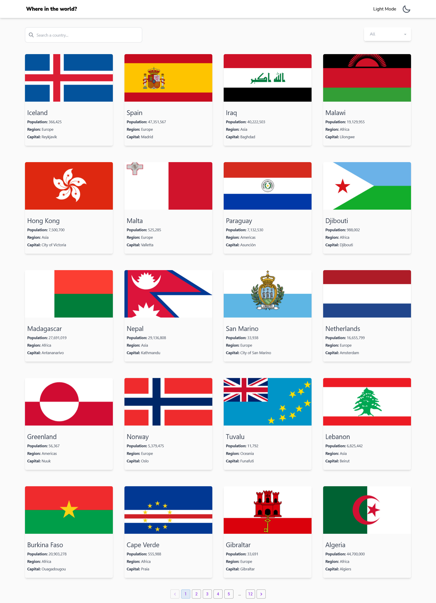

# Rest Countries Solution

## Table of contents

  - [Screenshot](#screenshot)
  - [Built with](#built-with)
  - [Useful resources](#useful-resources)

### Screenshot

### Built with

- Tailwind CSS (https://tailwindcss.com/) - CSS framework
- React (https://reactjs.org/)
- React Router DOM
- Rest Countries Api https://restcountries.com/
- Netlify
- daisyUI (https://daisyui.com/)
- MaterialUI (https://mui.com/)
- React-lazy-load-image-component (https://www.npmjs.com/package/react-lazy-load-image-component)

### Useful resources

- https://plainenglish.io/blog/light-and-dark-mode-in-react-web-application-with-tailwind-css-89674496b942

